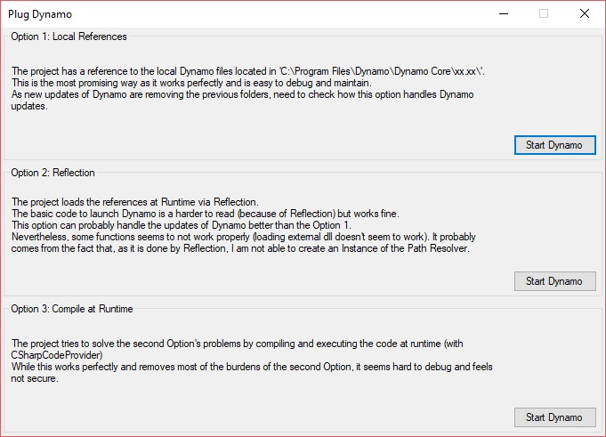

# PlugDynamo
Connect the [Dynamo plugin](https://github.com/DynamoDS/Dynamo) with a .Net application.

I am still looking for the right way to do it but here are 3 ways I was able to make it work.

Option 1: Local References
-------------

> The project has a reference to the local Dynamo files located in *'C:\Program Files\Dynamo\Dynamo Core\xx.xx\'*.
This is the most promising way as it works perfectly and is easy to debug and maintain.
As new updates of Dynamo are removing the previous folders, need to check how this option handles Dynamo updates.

Option 2: Reflection
-------------

> The project loads the references at Runtime via Reflection.
The basic code to launch Dynamo is a harder to read (because of Reflection) but works fine.
This option can probably handle the updates of Dynamo better than the Option 1.
Nevertheless, some functions seems to not work properly (loading external dll doesn't seem to work). It probably comes from the fact that, as it is done by Reflection, I am not able to create an Instance of the Path Resolver. 

Option 3: Compile at Runtime
-------------

> The project tries to solve the second Option's problems by compiling and executing the code at runtime (with *CSharpCodeProvider*)
While this works perfectly and removes most of the burdens of the second Option, it seems hard to debug and feels not secure.
